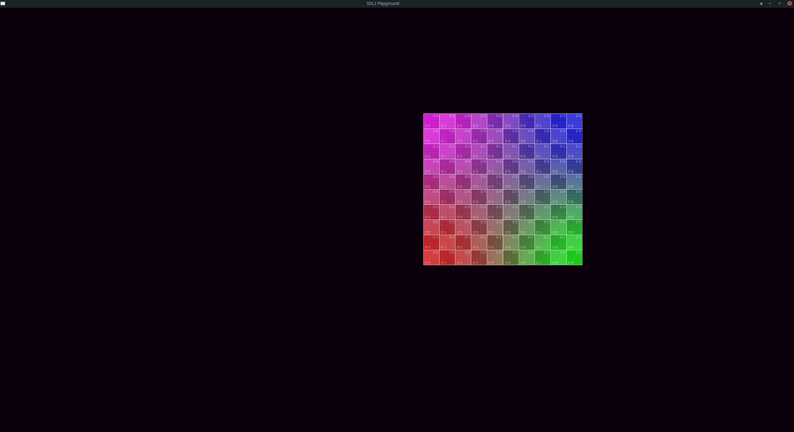

# Basic SDL3 boilerplate

## Pre-requisites:
- [SDL_shadercross](https://github.com/libsdl-org/SDL_shadercross)
    - [SPIRV-Cross](https://github.com/KhronosGroup/SPIRV-Cross)
    - [DirectXShaderCompiler](https://github.com/microsoft/DirectXShaderCompiler)


## Build
```bash
git clone --recurse-submodules git@github.com:Avicted/sdl3_playground.git

cd sdl3_playground

make && make run
```

## Features:
- Vulkan rendering
- Work in progress: 
    - Variable resolution with preserved aspect ratio with black bars
    - Box2D physics integration

- Game loop:
    - Input
    - Update
    - Render


## Credits: 
This software is based on code originally written by Caleb Cornett and licensed under the [zlib License] license. 


## Screenshot:

